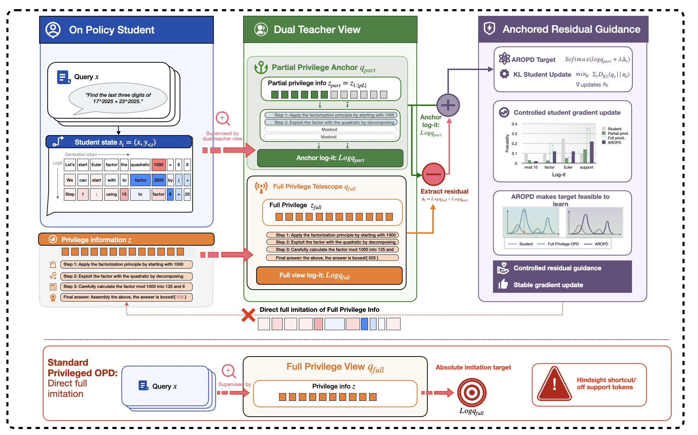
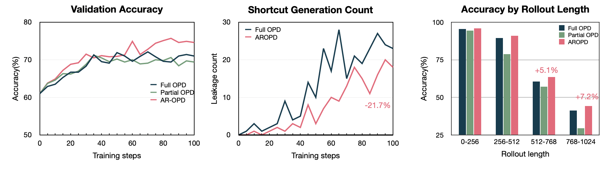
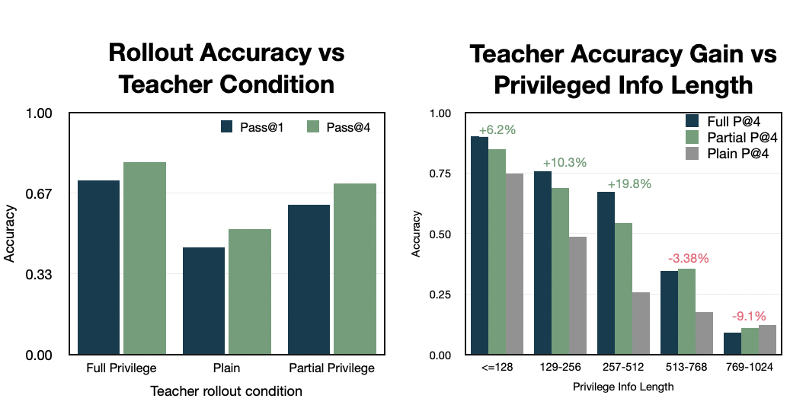

<h1 align="center">AR-OPD</h1>

<p align="center">
  <strong>Beyond Absolute Imitation: Anchored Residual Guidance for Privileged On-Policy Distillation</strong>
</p>

<p align="center">
  <a href="https://vanhowe.github.io/AR-OPD/">Project Page</a> |
  <a href="docs/assets/aropd-paper.pdf">Paper Draft</a> |
  <a href="https://github.com/vanhowe/GD-Train-Collab">Code Package</a> |
  <a href="ARXIV_CHECKLIST.md">arXiv Checklist</a>
</p>

<p align="center">
  
</p>

## Overview

AR-OPD studies a failure mode in privileged on-policy distillation: a full-view oracle teacher can provide useful answer-directed signal, but direct imitation may push the student toward tokens that are correct only under unavailable future information. AR-OPD treats this as a target-design problem by decomposing privileged supervision into:

- a **partial-view anchor** that remains locally reachable from the student prefix;
- a **controlled full-minus-partial residual** that transfers destination-directed foresight without turning the full teacher into an absolute target.

The result is a dual-view distillation target that preserves local sequence compatibility while still using privileged information.

## Highlights

| Result | Summary |
| --- | --- |
| Main average | **70.3**, the strongest average across seven benchmarks |
| vs. Full OPD | **+2.3 points** over full privileged OPD |
| vs. Base | **+12.1 points** over the base model |
| Shortcut diagnostic | **21.7% fewer shortcut events** than Full OPD at the final checkpoint |
| Long rollouts | **+7.2 points** over Full OPD on 768-1024 token rollouts |

## Method

Standard privileged OPD treats the full-view teacher distribution as the imitation target. This can be brittle because the teacher is conditioned on future information that the student cannot access at the current prefix. AR-OPD instead constructs:

```text
anchored target = partial-view anchor + lambda * (full-view signal - partial-view signal)
```

This keeps the target tied to a causally reachable partial view while using the full view only as a bounded directional update.

## Results and Diagnostics

<p align="center">
  
</p>

AR-OPD improves validation accuracy, reduces shortcut generation, and is strongest on longer rollouts. The long-horizon result is important because support mismatch is expected to compound as student prefixes drift farther from the privileged oracle trace.

<p align="center">
  
</p>

The target-reliability diagnostics show that full-view supervision can create larger teacher-student disagreement and support gaps near rollout tails. This supports the central design choice: privileged information should be decomposed and controlled rather than copied as a monolithic target.

## Code

The current training and evaluation code package is hosted in:

**https://github.com/vanhowe/GD-Train-Collab**

Useful entry points:

- [`scripts/prepare_data_layout.sh`](https://github.com/vanhowe/GD-Train-Collab/blob/main/scripts/prepare_data_layout.sh): restore GitHub-safe data chunks and validate the data layout.
- [`data/README.md`](https://github.com/vanhowe/GD-Train-Collab/blob/main/data/README.md): data layout, bundled evaluation sets, and local derived-data expectations.
- [`scripts/`](https://github.com/vanhowe/GD-Train-Collab/tree/main/scripts): launch, materialization, validation, and result-collection scripts.
- [`configs/`](https://github.com/vanhowe/GD-Train-Collab/tree/main/configs): hardware and experiment configuration files.

Minimal setup path:

```bash
git clone https://github.com/vanhowe/GD-Train-Collab.git
cd GD-Train-Collab
bash scripts/install_env.sh
bash scripts/prepare_data_layout.sh
bash scripts/materialize_all_derived_datasets.sh
```

## Data

The public code package includes GitHub-safe data assets and reconstruction scripts rather than large materialized training directories.

Included directly in `GD-Train-Collab`:

- raw math/code/medical training inputs as chunked GitHub-safe files;
- math, code, and medical evaluation JSONL files;
- ASFT-aligned math benchmark files;
- manifests and scripts for restoring and validating local data.

Kept local by design:

- materialized `data/derived/**` training datasets;
- checkpoints;
- large artifacts and report bundles.

After cloning the code package, run:

```bash
bash scripts/prepare_data_layout.sh
```

This restores chunked raw data and validates the expected asset layout. Derived datasets can then be rebuilt with the materialization scripts in `scripts/`.

## Repository Contents

- [`docs/index.html`](docs/index.html): project homepage.
- [`docs/assets/aropd-paper.pdf`](docs/assets/aropd-paper.pdf): current paper draft.
- [`docs/assets/architecture.png`](docs/assets/architecture.png): AR-OPD method architecture.
- [`docs/assets/training_dynamics.png`](docs/assets/training_dynamics.png): validation accuracy, shortcut count, and long-rollout results.
- [`docs/assets/teacher_reliability.png`](docs/assets/teacher_reliability.png): teacher reliability and support-gap diagnostics.
- [`ARXIV_CHECKLIST.md`](ARXIV_CHECKLIST.md): arXiv release checklist.

## Citation

```bibtex
@misc{aropd2026,
  title = {Beyond Absolute Imitation: Anchored Residual Guidance for Privileged On-Policy Distillation},
  author = {Wenhao Zhu},
  year = {2026},
  note = {Preprint}
}
```

The citation will be updated after the arXiv identifier is available.

## Security

Do not commit GitHub tokens, API keys, private checkpoints, private datasets, or local machine paths. If a personal access token has been pasted into any chat, document, issue, or terminal output, revoke it and generate a new one.
